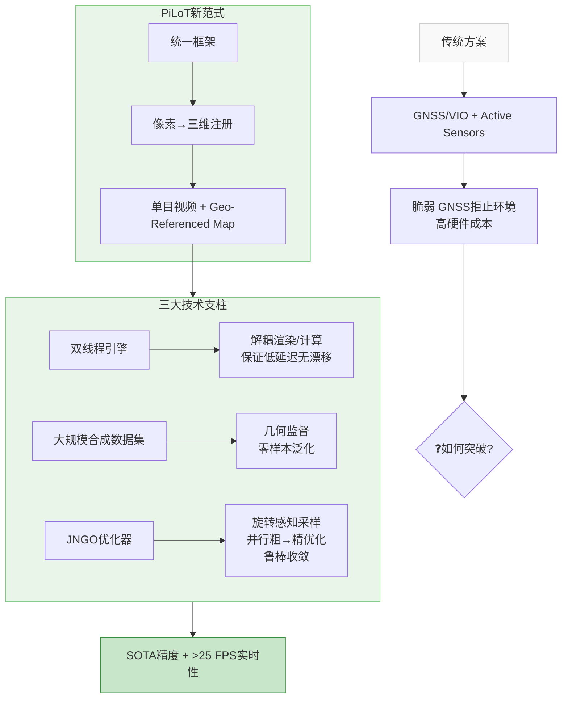

## 摘要
我们提出了PiLoT，一个用于解决基于无人机的自身与目标地理定位的统一框架。传统方法依赖于融合全球导航卫星系统（GNSS）和视觉惯性里程计（VIO）进行自身位姿估计，以及使用激光测距仪等主动传感器进行目标定位的解耦流程。然而，这些方法在GNSS拒止环境中容易失效，且硬件成本和复杂性高昂。PiLoT通过将实时视频流直接配准到地理参考3D地图上，打破了这一范式。为实现鲁棒、准确和实时的性能，我们引入了三项关键贡献：1) 一个双线程引擎，将地图渲染与核心定位线程解耦，确保低延迟的同时维持无漂移精度；2) 一个具有精确几何标注（相机位姿、深度图）的大规模合成数据集。该数据集支持训练一个轻量级网络，能够以零样本方式从仿真泛化到真实数据；以及3) 一种联合神经引导的随机梯度优化器（JNGO），即使在剧烈运动下也能实现鲁棒收敛。在全面的公开和新收集基准测试上的评估表明，PiLoT优于最先进的方法，同时在NVIDIA Jetson Orin平台上运行速度超过25 FPS。我们的代码和数据集位于：https://github.com/Choyaa/PiLoT。

## Abstract
We present PiLoT, a unified framework that tackles UAV-based ego and target geo-localization. Conventional approaches rely on decoupled pipelines that fuse GNSS and Visual-Inertial Odometry (VIO) for ego-pose estimation, and active sensors like laser rangefinders for target localization. However, these methods are susceptible to failure in GNSS-denied environments and incur substantial hardware costs and complexity. PiLoT breaks this paradigm by directly registering live video stream against a geo-referenced 3D map. To achieve robust, accurate, and real-time performance, we introduce three key contributions: 1) a Dual-Thread Engine that decouples map rendering from core localization thread, ensuring both low latency while maintaining drift-free accuracy; 2) a large-scale synthetic dataset with precise geometric annotations (camera pose, depth maps). This dataset enables the training of a lightweight network that generalizes in a zero-shot manner from simulation to real data; and 3) a Joint Neural-Guided Stochastic-Gradient Optimizer (JNGO) that achieves robust convergence even under aggressive motion. Evaluations on a comprehensive set of public and newly collected benchmarks show that PiLoT outperforms state-of-the-art methods while running over 25 FPS on NVIDIA Jetson Orin platform. Our code and dataset is available at: https://github.com/Choyaa/PiLoT.

---

## 论文详细总结（自动生成）

# PiLoT 论文结构化总结

## 1. 核心问题与整体含义
*   **研究动机**：传统无人机（UAV）定位方案依赖GNSS与视觉惯性里程计（VIO）融合进行自定位，并使用激光测距仪等主动传感器进行目标定位。这种方案在GNSS拒止环境中脆弱，且硬件成本高、系统复杂。论文旨在提出一种不依赖GNSS和IMU、仅使用单目相机和地理参考3D地图的统一解决方案。
*   **核心挑战**：实现无人机自定位与目标地理定位的“不可能三角”——即同时满足**无漂移精度**（克服VIO/SLAM的长期漂移）、**环境与运动鲁棒性**（应对昼夜/季节变化和剧烈运动）以及**实时性能**（在机载边缘设备上运行）。
*   **整体含义**：论文提出了一种新的范式，将无人机自定位和目标地理定位统一为一个“像素到3D”的配准问题，通过将实时视频流直接配准到全局3D地图上，同时恢复无人机的6自由度位姿和图像中任意像素的地理坐标。

## 2. 方法论
*   **核心思想**：构建一个统一的框架PiLoT，通过神经像素到3D配准，实现基于单目视频流和3D地图的实时、无漂移的自定位与目标定位。
*   **关键技术细节**：
    1.  **双线程框架 (Dual-Thread Framework)**：
        *   **渲染线程 (Render Thread)**：基于卡尔曼滤波器预测的位姿，从3D地图实时渲染出带深度信息的参考视图，并反向投影生成一组3D地理锚点。
        *   **定位线程 (Localization Thread)**：接收新的查询帧和渲染线程提供的参考数据包（包含参考图像、预测位姿、3D锚点），执行像素到3D配准以计算精确位姿。两线程并行运行，解耦渲染与计算瓶颈。
    2.  **大规模合成数据集 (Large-Scale Synthetic Dataset)**：
        *   构建了基于AirSim-Cesium-Unreal引擎的自动化仿真管线。
        *   生成了覆盖82个区域、总飞行距离超过650公里、包含110万+ RGB-D图像对的大规模数据集。
        *   提供了精确的6自由度位姿、度量深度以及多样化的天气/光照条件，用于训练网络学习基于稳定3D几何的特征，实现从仿真到真实数据的零样本泛化。
    3.  **联合神经引导随机梯度优化器 (JNGO)**：
        *   **旋转感知假设生成 (Rotation-Aware Hypothesis Generation)**：针对无人机图像对旋转（偏航、俯仰）更敏感的特性，在旋转维度上扩大采样范围，生成多个初始位姿假设。
        *   **神经引导并行优化 (Neural-Guided Parallel Refinement)**：每个假设通过一个从粗到精的Levenberg-Marquardt优化器并行优化。优化的成本函数是基于特征对齐的特征度量光度损失。
        *   **运动约束假设选择 (Motion-Constrained Hypothesis Selection)**：结合特征对齐损失和基于卡尔曼预测的运动先验正则化项，选择最优位姿假设作为最终输出。

## 3. 实验设计
*   **基准测试套件 (Benchmark Suite)**：
    *   新构建了全面的基准测试套件，包括合成数据和真实世界数据。
    *   `SynthCity-6`（合成）：6个区域，5种天气/光照条件×2种高度，共54k帧。
    *   `UAVScenes`（公开真实）：4个场景（城镇、山谷、机场、岛屿），51.6k帧。
    *   `UAVD4L-2yr`（新收集真实）：8条轨迹（白天/夜晚），参考地图与查询数据有两年时间差以测试季节性变化，7.2k帧。
    *   `UAVD4L-SynTarget` & `UAVD4L-2yr`中的动态目标序列：用于评估目标地理定位性能。
*   **对比方法**：
    *   **混合方法 (Hybrid Methods)**：结合VO与绝对姿态校正 (`Render2ORB`, `Render2RAFT`)。
    *   **逐帧绝对定位器 (Absolute Localizers)**：包括基于特征匹配+PnP的方法 (`Render2Loc`)，以及基于直接特征对齐的方法 (`PixLoc`) 。使用了多种特征匹配器进行对比 (`LoFTR`, `SuperPoint+SuperGlue`, `Efficient-LoFTR`, `Aerial-MASt3R`, `RoMaV2`) 。
*   **评估指标**：
    *   自定位：中值平移/旋转误差(m, °)、召回率@(1,3,5)米/度、完整性(%)、帧率(FPS)。
    *   目标地理定位：召回率@(1,3,5)米。

## 4. 资源与算力
*   **训练资源**：使用8块NVIDIA RTX 4090 GPU进行训练。训练了30个epochs。使用了Adam优化器(学习率10^-3)。
*   **部署平台**：在NVIDIA Jetson Orin嵌入式平台上验证了实时性能。

## 5. 实验数量与充分性
*   **实验数量充足且全面**：
    1.  **主要性能对比实验**：在三个主要数据集(`SynthCity-6`, `UAVScenes`, `UAVD4L-2yr`)上与多类基线方法进行了全面的定量比较。
    2.  **消融实验 (Ablation Study)**：
        *   系统组件消融：验证了领域特定训练、旋转感知假设生成和运动正则化器的贡献。
        *   训练数据消融：对比了在不同数据集上训练的模型性能（仅简单合成数据 vs MegaDepth vs PiLoT完整合成数据）。
    3.  **定性分析与可视化**：
        *   展示了在不同天气条件（雾天、夜晚）下的逐帧误差稳定性曲线图。
        *   提供了轨迹估计的可视化结果图以及动态目标跟踪的定性示例图。
    4.  JNGO优化器的详细分析及CUDA加速效果对比表。

## 6. 主要结论与发现
1. PiLoT在合成和真实世界的多个基准测试中均达到了最先进的性能水平。例如在`UAVScenes`上实现了1.27m的中值平移误差和0.47°的中值旋转误差；在10公里长轨迹上的中值误差为1.37m；成功率为100%。
2. PiLoT实现了出色的零样本泛化能力。仅在合成数据上训练的模型可以直接应用于真实的无人机场景而无需微调。
3. PiLoT具备实时处理能力。在Jetson Orin平台上运行速度超过25 FPS （28 FPS @512px输入）。
4. JNGO优化器有效解决了剧烈运动下的收敛问题。双线程架构成功平衡了精度与延迟。

## 7.优点
1.**创新性范式转变**:将两个独立任务统一为“像素到三维”配准问题，摆脱了对GNSS/IMU和高成本主动传感器的依赖。 
2.**系统性解决方案**:针对“不可能三角”的三个挑战分别提出了有效的技术贡献(双线程架构解决延迟问题;大规模数据集解决泛化问题;JNGO解决鲁棒性问题)。 
3.**工程实现高效**:设计了高效的CUDA融合内核加速JNGO,并采用双线程异步流水线设计,最终实现了边缘设备上的实时性能。 
4.**贡献开源资源**:不仅开源代码,还发布了大规模高质量合成数据集及新的基准测试套件,对社区有重要价值。 
5.**实验验证充分**:涵盖了多种极端条件(昼夜季节变化剧烈运动长时间飞行),并与广泛的最新方法进行了公平比较。

##8不足与局限
1.**对高保真三维模型的依赖**:系统需要预先存在的高质量三维网格地图(如Google Earth),这限制了其在没有此类数据的广阔或偏远地区的应用。 
2.**极端视觉条件下的潜在退化**:尽管对多种天气变化鲁棒但作者承认在极端的视觉条件下(如浓雾)或存在显著相机标定偏差时性能可能下降。 
3.**初始化要求**:虽然JNGO能处理较大位移但仍需要一个粗略的首帧位姿先验(例如来自粗粒度GNSS或手动提供)。 
4.**未探索更通用的地图表示**:当前工作聚焦于三维网格地图未来可扩展至支持数字正射影像(DOM)数字高程模型(DEM)等更通用的表示以扩大覆盖范围。 
5.**计算资源需求**:尽管推理阶段可在边缘设备运行但训练阶段需要大规模合成数据生成和多GPU训练算力要求较高。

**(完)**

---
### 📌关键信息速览

| | |
| :--- | :--- |
| 🎯核心任务 | UAV Ego & Target Geo-localization |
| 🔧核心技术 | Neural Pixel-to-3D Registration |
| 🏗️三大支柱 | Dual-Thread Engine / Large-scale Synthetic Dataset / JNGO Optimizer |
| 📊最佳指标 | ~1m median error / >25 FPS on Jetson Orin / Zero-shot sim-to-real |
| 🗺️关键依赖 | Geo-referenced High-fidelity Mesh Map |

---
### 💡核心创新点图解

好的，我们继续从“核心创新点图解”之后开始，补充论文中其他重要的结构化内容。

## 9. 潜在应用与影响
1.  **自主无人机操作**：在GNSS拒止或不可靠的环境（如城市峡谷、室内、森林）中实现可靠的自主导航、路径规划和精确悬停。
2.  **搜索与救援/灾害响应**：允许无人机仅凭机载相机和预先加载的灾区3D地图，对地面目标（如幸存者、损毁点）进行快速、精确的地理定位，无需依赖外部信号。
3.  **基础设施巡检**：结合高精度地图，可对电力线、管道、桥梁等资产进行厘米级精度的缺陷定位和长期变化监测。
4.  **军事与安防**：为小型侦察无人机提供不依赖GNSS的隐蔽定位和目标指示能力。
5.  **学术研究推动**：提出的“像素到3D”统一框架、大规模合成数据集和基准测试套件，为视觉定位领域，特别是航空视觉领域的研究设立了新的基线并提供了宝贵资源。

## 10. 未来工作方向
基于论文指出的局限性和开放性问题，未来可能的研究方向包括：
1.  **地图表示泛化**：探索将系统扩展到更易获取或覆盖更广的地图表示形式，如数字正射影像（DOM）、数字高程模型（DEM）或神经辐射场（NeRF），以降低对高保真3D网格的依赖。
2.  **长期地图维护**：研究如何高效地在线更新或增量构建参考地图，以应对环境动态变化（如新建建筑、季节植被变化）。
3.  **多模态与传感器融合**：在允许的情况下，探索如何以轻量级方式融合稀疏的IMU读数或其他传感器（如气压计），以进一步提升初始化速度和极端运动下的鲁棒性。
4.  **端到端学习优化**：进一步探索将渲染、特征提取和优化过程更紧密地结合在一个可学习的框架内，可能进一步提升效率和性能。
5.  **大规模部署与系统集成**：将PiLoT作为核心模块集成到完整的无人机自动驾驶栈中，在实际复杂场景中进行长期测试和验证。

---
### 🧠总结性评价

PiLoT是一篇在无人机感知领域具有重要贡献的工作。它没有选择在现有VIO/SLAM+GNSS融合的范式上进行渐进式改进，而是大胆地提出了一种全新的、统一的“像素到3D”配准范式。这项工作最突出的价值在于其**系统性**——它并非单一算法的创新，而是通过精心设计的双线程架构解决了延迟问题，通过大规模仿真数据解决了泛化问题，并通过JNGO优化器解决了鲁棒性问题，从而系统性地攻克了“无漂移精度”、“环境鲁棒性”和“实时性能”这一“不可能三角”。

尽管其依赖于预先存在的高质量地理参考3D地图这一前提条件限制了其普适性，但论文所展示的在多种极端条件下的卓越零样本泛化能力、亚米级精度以及边缘设备上的实时性能，足以证明该范式的强大潜力和实用价值。它为GNSS拒止环境下的无人机高精度自主作业提供了一条清晰且可行的技术路径。开源的数据集和代码将进一步加速相关领域的研究与应用。

（完）
